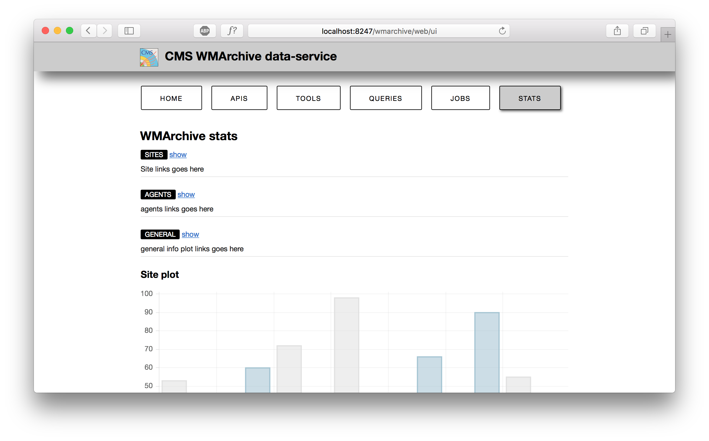
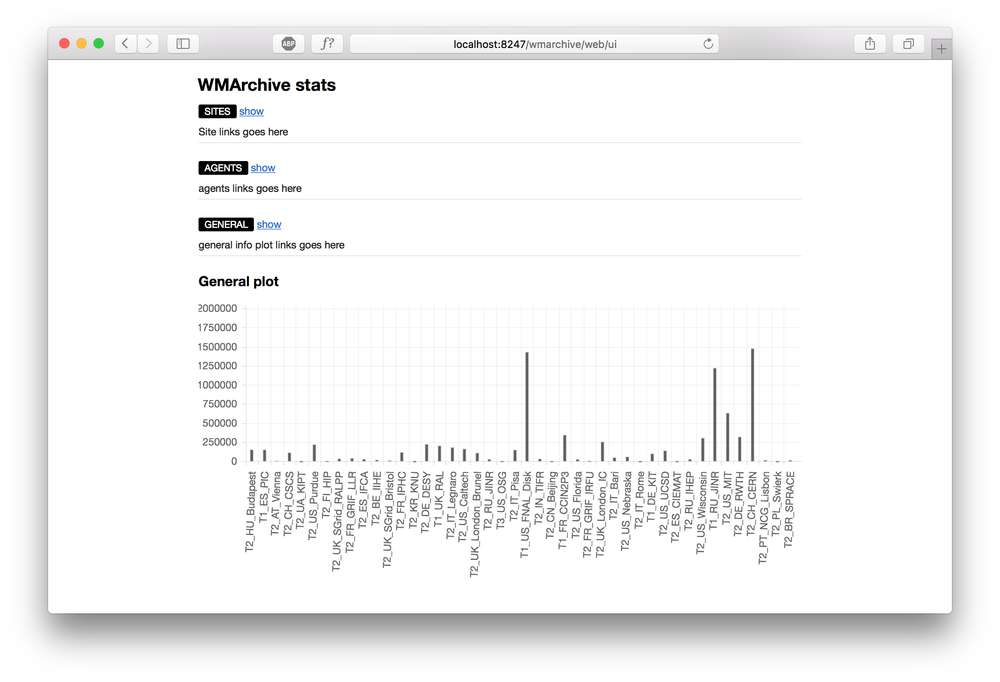
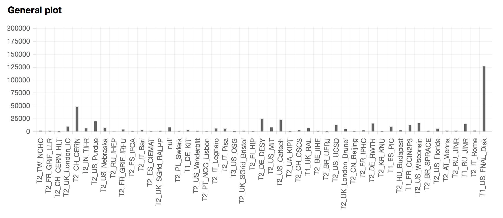
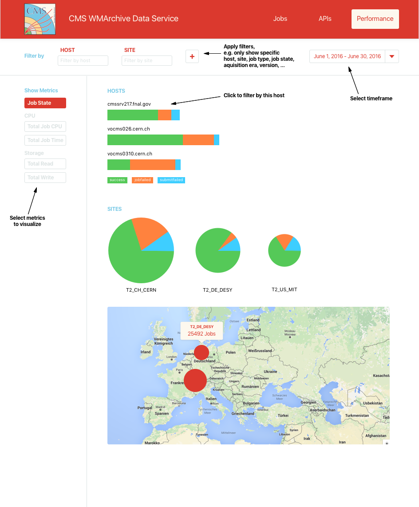
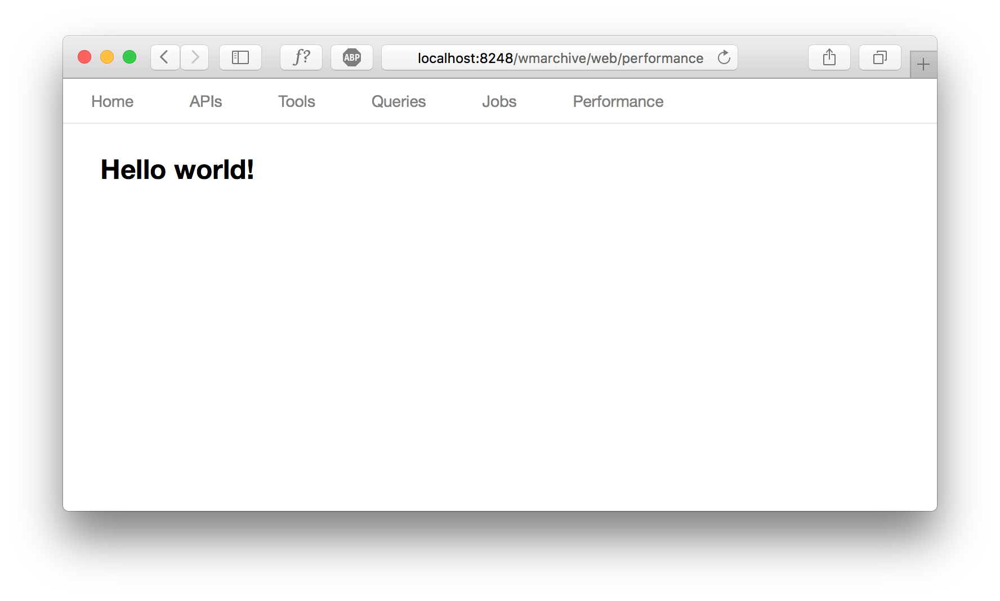

# Report 001 - July 8, 2016

## Running the Server and generating sample data

- Summarized the procedure to [run the WMArchive server](docs/running-wmarchive-server.md).
- At this point the server runs on my local machine with the provided starting point:

	

- Summarized the procedure to [generate sample data from the HDFS and import it to the local MongoDB instance](docs/generating-sample-data.md)
- Now the server shows actual data from 2016/06/28 (host 'vocms0311.cern.ch'):

	

- Summarized the procedure to [run WMArchive environment remotely](docs/running-wmarchive-server.md) on vocms013.


## Data structure considerations for performance metrics

- Aggregated performance metrics stored in MongoDB must preserve a lot of the original FWJR data for filtering: It must be possible to query metrics for a specific scope, e.g. a specific host, site and jobtype, but also aggregate over them for more coarse views of the data.
- Nested dictionaries (e.g. host > site > ... > performance metrics) are very rigid since additional filters (e.g. aquisition era, ...) would require the data structure to change. Also this would impose a hierarchy on the filters: Queries that follow the hierarchy are very efficient, but others require traversing the entire graph. I do not plan to impose such a hierarchy on the UI, so this approach seems unsuitable.
- Instead, I propose to store a collection of performance metric objects in the database that each have an associated _scope_. The scope captures the filters the given performance metrics apply to, e.g. the host, site and jobstate. Redundant metrics where the scope is less constrained (e.g. where the host is omitted) can be stored to cache aggregations over some filters.
- For now, the metrics objects can be stored in an unordered list in a MongoDB document for each day (see `./sample_data/RecordAggregator_result.json`). There is obviously much optimization potential here.
- Using this data structe, the native MongoDB aggregation pipeline can be applied to the performance metric objects. This makes queries over specific scopes very convenient:

	**Distinct values:**
	
	```
	# For one document with date 2016-06-28 in the daily collection:
	> db.daily.distinct('stats.scope.host')
	[
		"cmssrv217.fnal.gov",
		"vocms026.cern.ch",
		"vocms0309.cern.ch",
		"vocms0310.cern.ch",
		"vocms0311.cern.ch"
	]
	> db.daily.distinct('stats.scope.site')
	[
		"T1_DE_KIT",
		"T1_ES_PIC",
		"T1_FR_CCIN2P3",
		"T1_RU_JINR",
		"T1_UK_RAL",
		"T1_US_FNAL_Disk",
		"T2_AT_Vienna",
		...
	]
	> db.daily.distinct('stats.scope.jobstate')
	[ "jobfailed", "submitfailed", "success" ]
	> db.daily.distinct('stats.scope.jobtype')
	[
		"Harvesting",
		"LogCollect",
		"Merge",
		"Processing",
		"Production",
		"Skim"
	]
	```

	**More specific aggregations:**
	
	```
	> db.daily.aggregate([{$match: {date: "2016-06-28"}},{$unwind: "$stats"},{$group: {_id: "$stats.scope.site", count: { $sum: "$stats.count"}}}])
	{ "_id" : "T2_TW_NCHC", "count" : 2631 }
	{ "_id" : "T2_FR_GRIF_LLR", "count" : 1787 }
	{ "_id" : "T2_CH_CERN_HLT", "count" : 27 }
	{ "_id" : "T2_UK_London_IC", "count" : 10533 }
	{ "_id" : "T2_CH_CERN", "count" : 48458 }
	...
	```


## Implementation of a first aggregation pipeline

- I implemented a first Spark job to aggregate performance metrics structured as described above in the `RecordAggregator.py` script.
- The data generated there is written directly to MongoDB on the remote node (`vocms013`). In `MongoStorage.py:MongoIO.site_count` I can therefore directly apply the aggregation pipeline described above and return the data through a REST endpoint.
- From the UI I can then issue an AJAX query to the REST endpoint and display the results with Charts.js:
	
	
	
	The plot shows the number of FWJR for each site on 2016-06-28.	


## Mockup of the WMArchive Performance Web UI

- With an overview of the FWJR data available from the HDFS and an initial aggregation pipeline in place, I propose the following basic UI for the web service:

	

- The design exhibits the CMS corporate design colors to aid in the user experience: The red color signals interactivity such as with filters and buttons, whereas blue elements provide structural guidance.
- The design provides users with the opportunity to directly select filters at the top of the page when they are looking for specific information. Interacting with elements on the page can also refine the scope, e.g. a click on a host or site will add the appropriate filter.
- Users can then select the performance metrics they are interested in on the left side of the page. Additional features may include the possibility to compare multiple metrics with each other.
- The main section of the page dynamically displays graphs corresponding to the selected scope and metrics. Examples include:
	- An overview of hosts with their job success rate, where each bar length corresponds to number of jobs relative to the other hosts and the colored bar segments indicate the job states
	- A similar overview of sites arranged in a grid of pie plots sized according to their number of jobs
	- A map to visualize geographic differences in job performance


## First implementation of the WMArchive Performance Web UI

- To build upon the WMCore WMCore REST server functionality, I stick with the single-endpoint approach so far where the `FrontPage` is served by WMCore and everything else is handled by JavaScript. In the future I may re-evaluate this approach and implement endpoints for the the pages that exist in parallel to the _Performance_ UI.
- In a first implementation of the web UI I explored various JavaScript frameworks for URL routing and MVC architecture. I chose [Backbone.js](http://backbonejs.org) as a lightweight addition to the WMCore infrastructure.
- I finally recreated the page-based structure of the existing content with a Backbone router and [Underscore](http://underscorejs.org) templates where now the URL appropriately reflects the displayed page:

	
- In the next steps I will implement the UI proposed in the mockup above and connect to the `site_count` REST endpoint with the aggregation pipeline already implemented. I will then refine the REST endpoints and further develop the UI.
