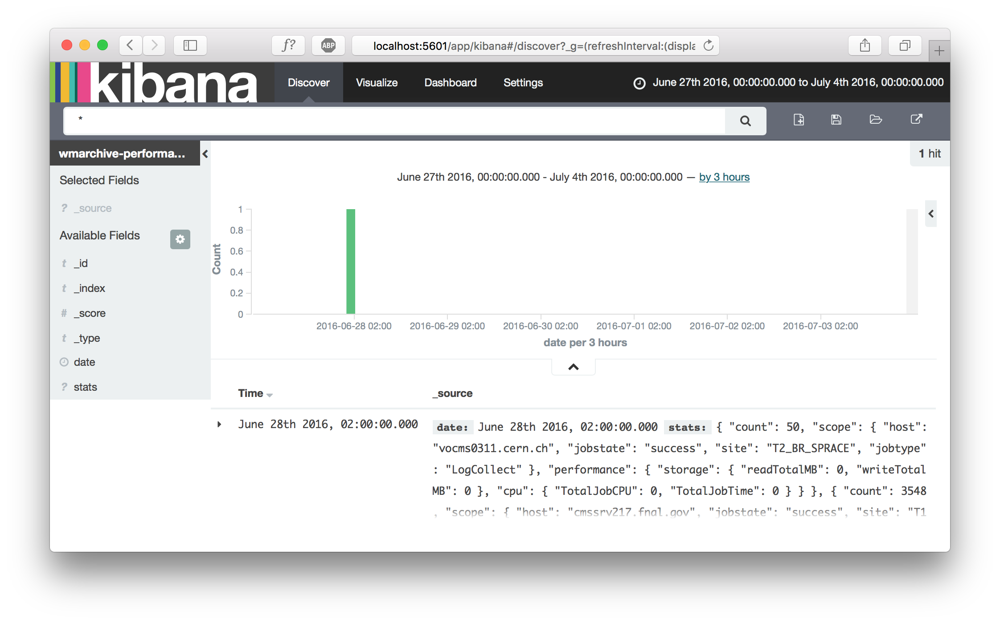
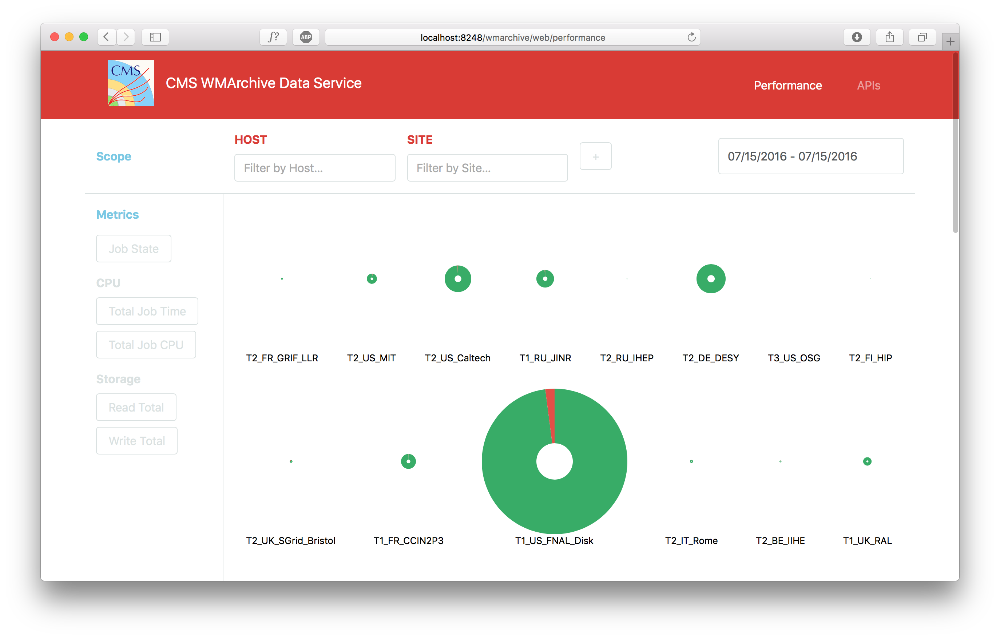

# Report 002 - July 15, 2016

## ElasticSearch and Kibana

- I installed [ElasticSearch](https://www.elastic.co/products/elasticsearch) and [Kibana](https://www.elastic.co/products/kibana) and imported the [sample data](sample_data/RecordAggregator_result.json) with a custom [mapping](sample_data/elasticsearch_mapping.json). Kibana displays the imported data:
	
	
- Kibana is backed by ElasticSearch which we may use as an alternative to MongoDB for performance metrics storage. It's basically a drop-in replacement for MongoDB with the advantage that it already exposes its data through a REST API.
- Kibana in turn consumes this API to show highly customizable data visualizations. However, it so far lacks support for _nested types_ as discussed in [this issue](https://github.com/elastic/kibana/issues/1084). We may try to circumvent this limitation by adapting the data structure proposed in [Report 001](001_2016-07-08.md) or the way it is represented in ElasticSearch.
- Then Kibana allows to create dashboards such as [these](https://www.elastic.co/guide/en/kibana/current/dashboard.html). This would enable us to inspect the performance data in great detail without the need to implement the UI. However, this also implies that the UI is constrained by the features offered by Kibana as well as possibly polluted with unneccessary information. In particular, with this approach we have little control over the user interaction with the visualizations. As an example, a workflow where the user selects a particular section of a graph (e.g. corresponding to a host or site) to apply an appropriate filter to the visualization seems difficult to accomplish.
- Therefore I propose to implement a UI backed by [D3.js](https://d3js.org) instead of Kibana. This allows us to create visualizations that are precisely tailored to our needs while the library provides the rendering functionality, thus allowing for more flexibility in the user interface than with Kibana. If the user interaction proves to be more complicated to implement than expected, we may re-evaluate Kibana.
- I also propose to stick with MongoDB over ElasticSearch for now since its [aggregation pipeline](https://docs.mongodb.com/manual/core/aggregation-pipeline/) provides exactly the tools required to feed our REST API endpoints that are in turn consumed by the UI. We may switch to ElasticSearch without much difficulty at any time if necessary, at which point I still suggest to wrap ElasticSearch's REST API in our custom endpoints such that this logic is implemented by the server as opposed to the JavaScript UI that consumes it.

## Frameworks and Libraries

- I am strongly in favour of utilizing established and well-crafted frameworks instead of reinventing solutions to common problems. The WMArchive web application visualizes the FWJR performance data with a workflow optimzied for CMS data operators. Therefore I aim to focus my efforts on this functionality while building upon frameworks and libraries that provide the site architecture and rendering solutions.
- I explored various technologies and chose the following to base my working prototype on:
	- [Backbone.js](http://backbonejs.org) for MVC site architecture
	- [Sass](http://sass-lang.com) for CSS preprocessing
	- [Bootstrap](http://getbootstrap.com) for responsive CSS
	- [D3.js](https://d3js.org) for visualization
	

## Prototype Implementation

- Starting from my design proposal mockup in [Report 001](001_2016-07-08) I implemented the basic architecture and UI of the WMArchive web application.
- The server so far exposes a sample REST endpoint `site_count` that performs a MongoDB aggregation to return a list of all sites, each with their number of successful and failed jobs.
- The frontend consumes this endpoint through an AJAX request and subsequently renders a proof-of-concept visualization using D3.js. It shows the job state distribution for each site in a pie chart that is in turn sized relative to the total number of jobs:
	
	
- With this working prototype I am now in the position to define and implement the REST API endpoints that will provide the frontend with the performance data. I will then iteratively collect and implement visualizations based on the CMS data operators' requirements and simultaneously refine the UI to provide an optimized workflow.
