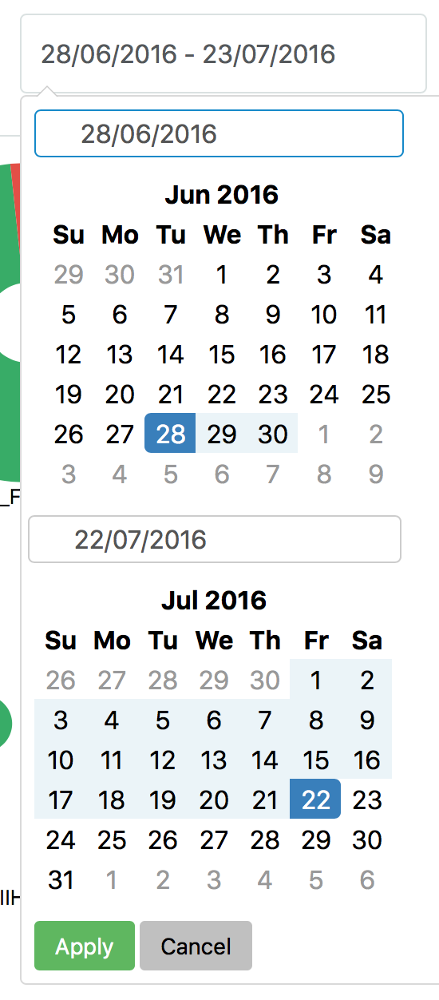

# Report 003 - July 22, 2016

## `/data/performance` REST endpoint

- The WMArchive service already provides a number of preliminary endpoints under `/data` where the _query arguments_ differentiate between them. In particular these include the service status at `/data?status=1` and the running jobs at`/data?jobs=1`. I decided to move the endpoint for performance data to `/data/performance` instead to separate it semantically from the other endpoints. I propose to restructure the remaining endpoints accordingly by moving from the query argument to the URL path.
- The `/data/performance` endpoint takes query arguments to define both the scope and the context of the request. The scope can so far include the `start_date`, `end_date`, `host` and `site` where all arguments are optional. This allows to filter the analyzed performance data as coarse or narrow as required. The context so far defines the requested `metric` and is a required argument. Sample URLs include:
	- `/wmarchive/data/performance?metric=jobstate`: Performance metrics about the job state accumulated over all available data
	- `/wmarchive/data/performance?metric=totalJobTime&start_date=20160628&site=T2_DE_DESY`: Performance metrics about the job time accumulated over jobs since June 28, 2016 processed on the `T2_DE_DESY` site
- The endpoint utilizes the [MongoDB Aggregation Pipeline](https://docs.mongodb.com/manual/core/aggregation-pipeline/) to efficiently filter and process the performance data according to the requested scope and context.
- According to the given context, the endpoint chooses appropriate metrics to return in a dictionary. So far this includes:
	- For context `metric=jobstate`: both the job state per host and per site
	
		```json
		metrics": {
			"jobstatePerHost": [
				{
					"host": "vocms0311.cern.ch",
					"jobstates": [
						{
							"count": 11904,
							"jobstate": "success"
						},
						{
							"count": 19,
							"jobstate": "jobfailed"
						}
					]
				},
				// ...
			],
			"jobstatePerSite": [
				{
					"site": "T2_DE_DESY",
					"jobstates": [
						{
							"count": 25460,
							"jobstate": "success"
						},
						{
							"count": 32,
							"jobstate": "jobfailed"
						}
					]
				},
				// ...
			]
		}
		```
		
	- For context `metric=totalJobTime`: the average job time per site
		
		```json
		"metrics": {
			"jobtimePerSite": [
				{
					"averageJobTime": 4458.229475398086,
					"site": "T2_DE_DESY"
				},
				// ...
			]
		}
		```
	
	In the next steps I will expand this extensively.
	
- Additionally, the endpoint provides useful data such a list of all hosts and sites for the client to consume. These may move to separate endpoints in the future.

## WMArchive performance client architecture

- I implemented most of the architecture required for the client site functionality building upon the [Backbone.js](http://backbonejs.org) JavaScript MVC framework:
	- The implementation focuses on a single stateful `Scope` model object that exposes the scope and context attributes defined by the `/data/performance` endpoint described above.
	- Views displayed on the site, such as the timeframe picker, the scope filters and the metric selectors, reflect the state of these attributes and change them according to user interaction.
	
		
	- The `Scope` object in turn fetches the appropriate data from the API endpoint and exposes it through its `metrics` attribute.
	- The `Performance` view then delegates the responsibility to visualize the `metrics` data to the appropriate visualization view.
	- Each visualization view renders the data it received in a highly customized way utilizing the [D3.js](d3js.org) visualization library.
		
		

- The timeframe picker is built upon the [Daterangepicker](https://github.com/dangrossman/bootstrap-daterangepicker) component.

	
- With the list of hosts and sites provided by the API, I can provide a useful autocomplete feature in the scope filters utilizing the [Twitter Typeahead & Bloodhound Framework](https://github.com/twitter/typeahead.js). This enables the user to instantly select an existing host or site from the list or refine their search by typing.
	
	
- With the site, visualization and user interaction architecture in place, I can now implement any number of performance data visualizations and extend the user interface to allow for any scope or context. I aim to provide a platform with useful insights into the FWJR data that is tailored to the CMS data operators' workflows. To this end I will collect types of visualizations and workflows based in the CMS data operators' requirements and iteratively incorporate them into the WMArchive performance platform.
