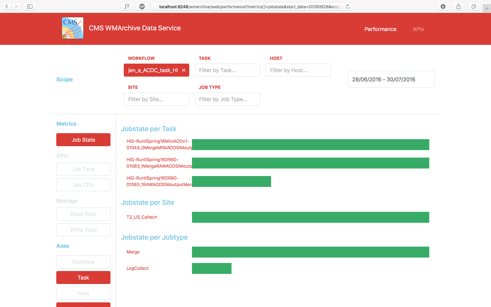
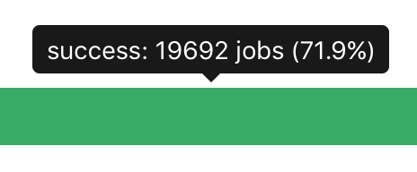
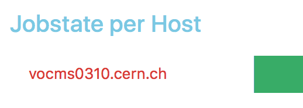

# Report 004 - July 29, 2016

## Additional scope features

- I added the `workflow`, `task` and `step` scopes and explored their values for 28/6/2016:

	```
	> db.daily.distinct('stats.scope.step')
	[
		"CRITICAL",
		"JobKilled",
		"JobSubmit",
		"NoJobReport",
		"PerformanceError",
		"cmsRun1",
		"cmsRun2",
		"logArch1",
		"logCollect1",
		"stageOut1",
		"upload1"
	]
	> db.daily.distinct('stats.scope.workflow')
	[
		"bsutar_HLT_newconditions0_RelVal_275657_160628_111322_621",
		// over 400 values
	]
	> db.daily.distinct('stats.scope.task')
	[
		"B2G-RunIIFall15DR76-01031_1AODSIMoutputMergeLogCollect",
		// over 1500 values
	]
	```

- Further scopes can be added easily. However, every additional scope will contribute multiplicatively to the number of stored documents in the `performance` database.


## Generalized visualization architecture

- In addition to the _Scope_ and _Metrics_ selectors, I added a similar user interface to select the desired _Axes_ for visualization. This enables the user to first specify the scope of their query by choosing filters, then select the metrics they are interested in and finally choose along which axes they want to visualize the data.
- The axes correspond to the scope options such as `workflow`, `task`, `host`, `site` and `jobtype`.
- Multiple axes can be selected simultaneously. The same also applies to selecting metrics now.
- All combinations of metrics and axes are visualized on the canvas and labeled _{METRIC} per {AXIS}_.
- For instance, the user can now select a specific workflow and inspect the job success rate per task, per site or per job type.

	


## Visualization improvements

- I started improving the sample visualizations. In the next steps I will focus on developing them further.
- I added architecture to display tooltips.

	
- I implemented links embedded in the visualizations that refine the scope.

	


## Persistent URLs

- The URL now reflects the user's selection of scope, metrics and axes. This allows them to send a link to a specific visualization setup to a collaborator.
