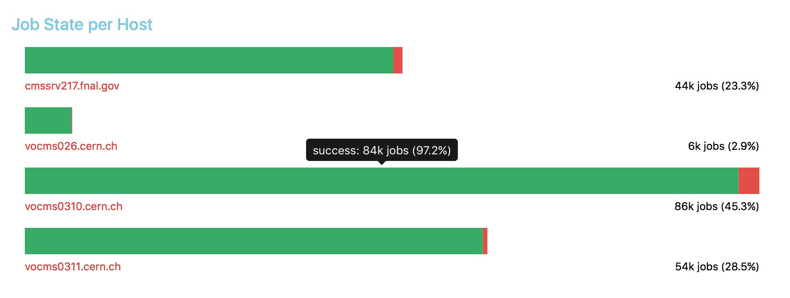

# Report 005 - August 5, 2016

## Flattened data structure

- The performance data is now stored in MongoDB as individual documents, each with their associated scope and timeframe, as opposed to one document per day.
- The schema of documents in the database reads as follows, where the number in brackets for the scope filters gives an estimate of the number of distinct values for one day and the comment shows a sample value:

  ```
  {
  	"scope" : {
      "workflow" : String(~500), // "pdmvserv_EXO-RunIISummer15wmLHEGS-00800_00087_v0__160622_190033_1539"
      "task" : String(~1k), // "EXO-RunIISpring16DR80-01801_1"
      "host" : String(~5), // "vocms0311.cern.ch"
      "site" : String(~50), // "T2_DE_DESY"
  		"jobstate" : String(3), // "success"
      "jobtype" : String(~5), // "Processing"
  		"step" : String(~10), // "cmsRun1"
  		"acquisitionEra" : String(~25) // "RunIISpring16DR80"
      "exitCode": String(~28) // "99999"
  	},
  	"start_date" : Date(1 day resolution),
  	"end_date" : Date(1 day resolution),
  	"performance" : {
      // ...
  	}
  }
  ```
- This set of scope filters leads to ~15k documents per day with ~5MB memory consumption.
- I will now confirm the set of required filters and then provide more detailed statistics.
  - Possibly, the `scope.step` values with varying number suffix could be merged, such as `cmsRun1`, `cmsRun2` to `cmsRun`.
- **Edit from [Report 007](007_2016-08-19.md)**: Added `exitCode` scope and merged `scope.step` as detailed above. The performance metrics are detailed in [Report 007](007_2016-08-19.md).


## Generalized jobstate visualization

- I generalized the visualization architecture to all possible metrics.
- So far, only the `jobstate` metric has a dedicated visualizations, whereas all others fall back to a preliminary _default_ visualization.
- With this architecture, I can dynamically expand the performance metrics stored in the database and visualized in the UI, providing customized visualizations as needed.
- I improved the jobstate visualization with tooltips, label formatting and scope links:

  


## Aggregator optimization

- I improved the performance data aggregation algorithm by moving the data extraction and aggregation to standalone functions used by both the mapper and the reducer.
- Implemented fallback for `pymongo < 3.0`.


## Test deployment

- I deployed the WMArchive performance service prototype to `vocms013` for testing. To access it, setup an SSH tunnel:

  ```
  ssh -L 8888:localhost:8250 USERNAME@vocms013
  ```

  Now you can access the performance UI with your browser:

  [WMArchive performance service](http://localhost:8888/wmarchive/web/performance)


## Remaining tasks

- [ ] Iteratively test, improve and extend the UI and the visualizations according to feedback from data operators
- [ ] Generate detailed statistics for storage and processing requirements to obtain the performance data and decide for a storage strategy based on this knowledge
- [ ] Setup a job schedule to generate the performance data in production
