# Report 006 - August 12, 2016

## Finalizing the Scope

- The preliminary set of scope filters is described in [Report 005](005_2016-08-05.md). I stripped numbers from step names so that e.g. `cmsRun1`, `cmsRun2` etc. are merged to `cmsRun`.
- I completed the scope filter architecture and the UI to accdomodate for the additional filters:

  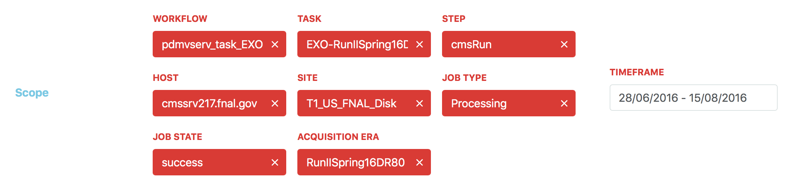

  Possible improvements include a dynamic presentation of filter fields that the user can add to the UI.
- An autocomplete feature that takes the currently selected scope into account is already available as well:

  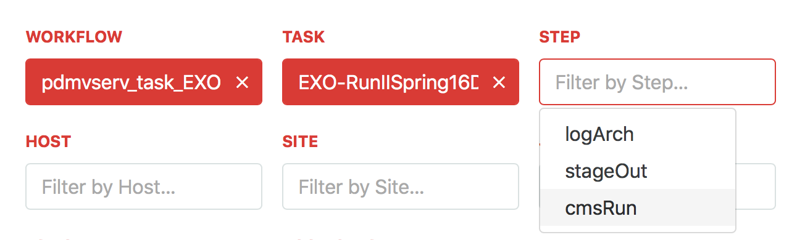
- Finalizing the required set of scope filters takes high priority now, since the scope granularity has great impact on storage and performance requirements as well as the UI. Detailed feedback from the target user group is required for this.
- [This sample FWJR](sample_data/FWJR.json) gives some indication on the currently available data. More FWJRs to inform decisions are available in MongoDB on `vocms071`:

  1. `ssh USERNAME@vocms071`
  2. `mongo --port 8230`
  3. `use fwjr`
  4. `db.db.findOne()` display any single FWJR, or refine with e.g. `db.db.findOne({ 'meta_data.jobstate': 'success' })`

## Generalized visualizations for all metrics

- I implemented a flexible default visualization for all metrics and axes. It presents the data in a vertical bar chart for a small number of data points:

  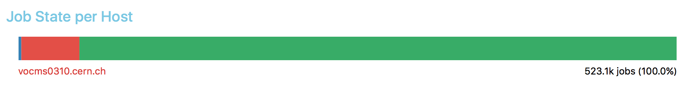

  For a larger number of data points, the data is visualized in a grid instead:

  - Default grid:

    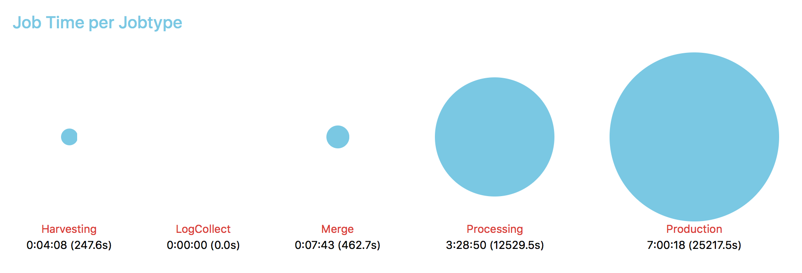

  - Grid with additional dimension:

    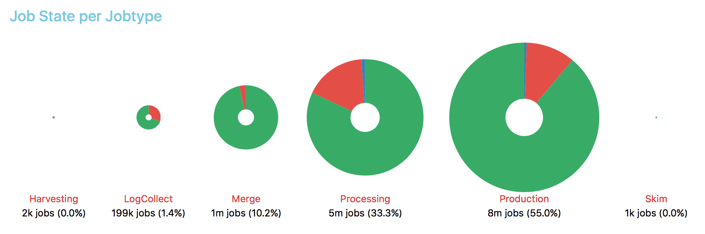

- All visualizations are capable of displaying tooltips and include interactive labels that refine the scope appropriately on selection:

  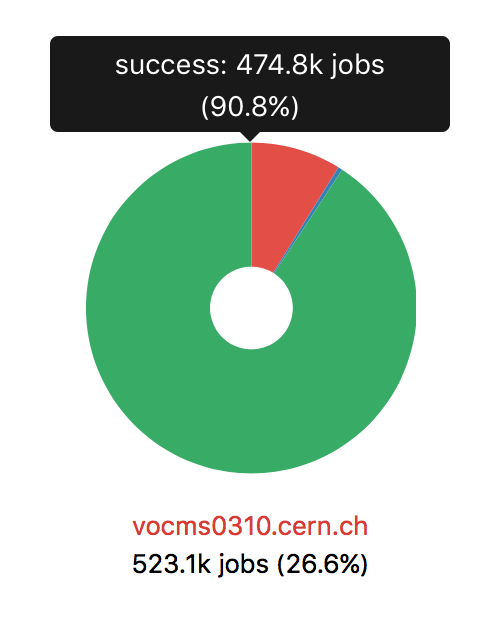

- The default visualization can be extended for specific configurations such as [time series](#time-series-visualization).

## Time series visualization

- I implemented a dedicated visualization for time series:

  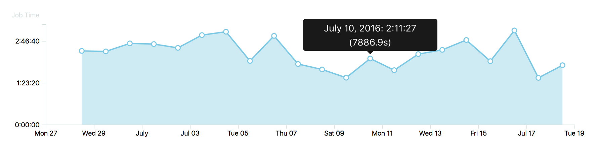
- It is also capable of handling an additional dimension:

  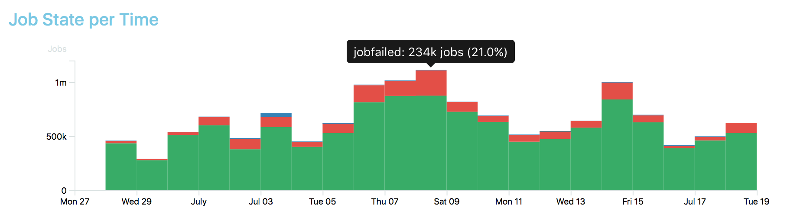

## Human-readable formatting

- I added formatting logic so that the visualized values are displayed in a human-readable format. So far, these include:
  - Numbers:

    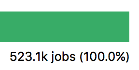
  - Time:

    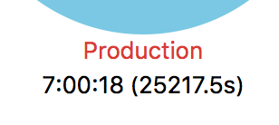
  - Memory:

    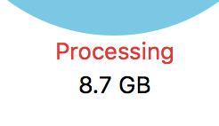

## Loading Indicator

- I added a loading indicator to improve the user experience for extensive database queries. In order to retain the overall CMS branding, I based its design on the CMS logo:

  
