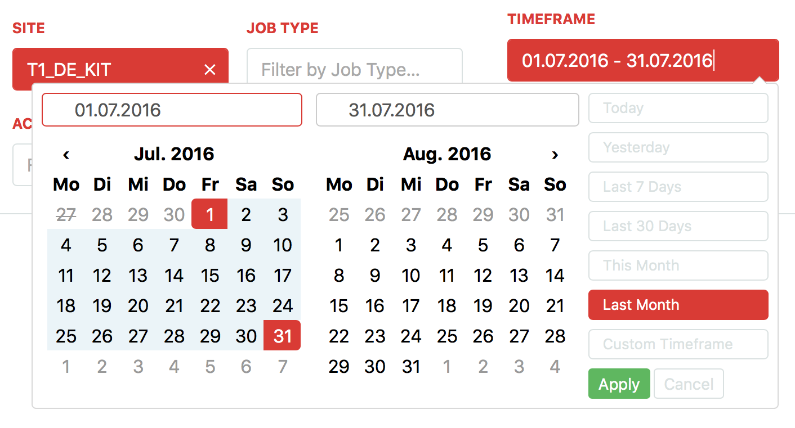
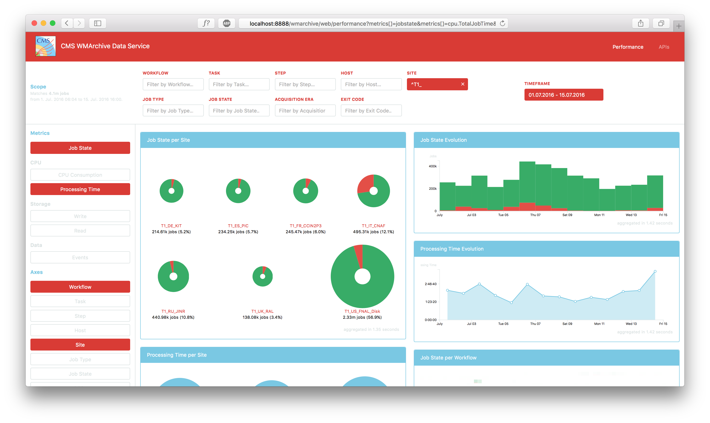
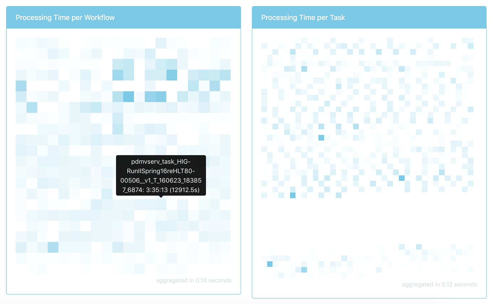
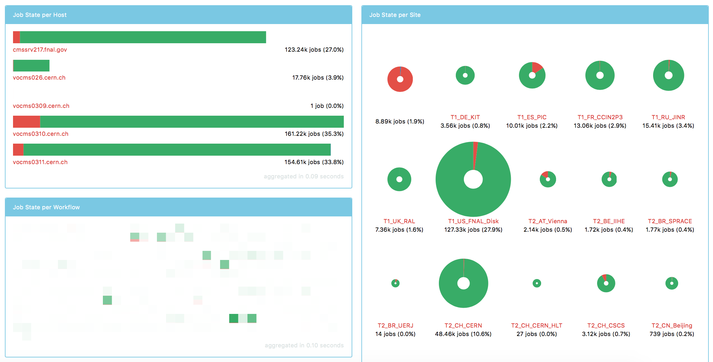
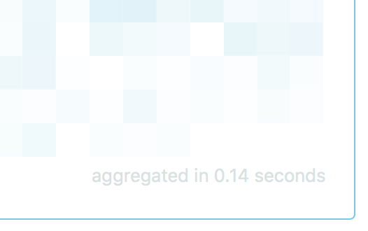

# Report 008 - August 26, 2016

From the first prototype deployment on the [CMS testbed](https://cmsweb-testbed.cern.ch/wmarchive/web/performance) I received a large amount of useful feedback. I summarize this below and also indicate the steps I have already taken to address each issue.

## Dynamic Timeframe and Timeframe Picker

The timeframe picker needed a number of improvements. They are all implemented now.

- [x] The timeframe input now adapts the same style as other active scope filters.
- [x] The initial timeframe now defaults to the last seven days.
- [x] The timeframe picker offers a number of reasonable choices in addition to custom ranges.
- [x] The timeframe is constrained to the available data in the performance database. Only valid dates can be chosen in the picker. User input is validated and constrained if necessary.
- [x] The timeframe picker and all other UI elements now present dates formatted according to the user's locale.
- [x] Buttons to navigate months in the timeframe picker now appear correctly.
- [x] Browser-provided date pickers do not interfere with the timeframe picker anymore.

- I do not intend to address performance issues that may occur from selecting a large timeframe by restricting the timeframe selection through the UI. I will instead address performance issues serverside, presumably by an appropriate choice of data granularity in the database.

## Scope UI

- [x] In the context of a chosen scope, I added information on the number of jobs the scope matches, as well as their exact timeframe:

  
- [x] Since distinct workflow and task values are unbound and can exceed reasonable numbers very quickly, I removed their corresponding suggestions from their scope filter inputs.

## Regular expressions in scope filters

- [x] Users can now enter a regular expression instead of a specific value for any scope filter:

  

## Responsive layout for large screens

- [x] The visualizations are now arranged in a responsive column layout to make better use of large screens:

  

  The layout adjusts the number of columns according to the size of the viewport.

## Visualizations

- [x] Implemented a heatmap visualization that replaces the grid of pie charts for a large number of data points:

  

  Currently, the default visualization for all metrics and axes except time series adjusts to the number of data points. It shows horizontal bar charts for a small number of data points, switches to a grid of pie charts for more data points and resorts to a heatmap for a large number of data points:

  

  I may reconsider this approach and decide for a type of visualization depending on the chosen axis, e.g. always present hosts as bar charts, sites as pie charts and workflows as a heatmap.
- [x] Added a minimum size for pie charts.
- [x] When a visualization fails to fetch its data it now displays an appropriate error.
- [ ] Implement legends for visualizations.
- [ ] Fix overlong labels overlapping each other in pie charts.
- [ ] Decide for a sorting behaviour of data points in a visualization and implement a corresponding user interface if necessary.
- [ ] Decide for an ordering behaviour of visualizations in the UI.
- [ ] Implement human-readable formatting for _null_ values.
- [ ] Display exit codes in human-readable format (documentation necessary, see [WMArchive issue #216](https://github.com/dmwm/WMArchive/issues/216)).
- [ ] Decide for the set of metrics available in the UI and implement their formatting (documentation necessary, see [WMArchive issue #216](https://github.com/dmwm/WMArchive/issues/216)). All performance metrics provided by FWJRs are already aggregated in the database and available through the `data/performance` API endpoint.

## Performance

- [x] Added information on the aggregation query time to each visualization:

  
- [ ] Investigate aggregation performance depending on temporal data granularity in the database. Setup an aggregation strategy that maintains appropriately coarse performance data in the database.

## Utility

- [ ] Add functionality to share specific visualizations, e.g. via URL
