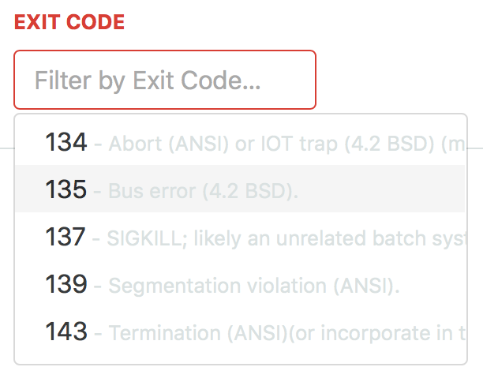
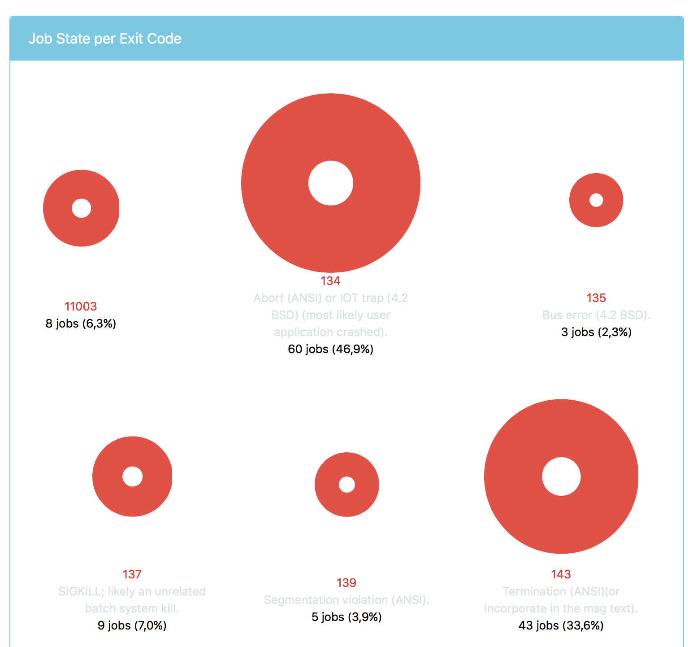
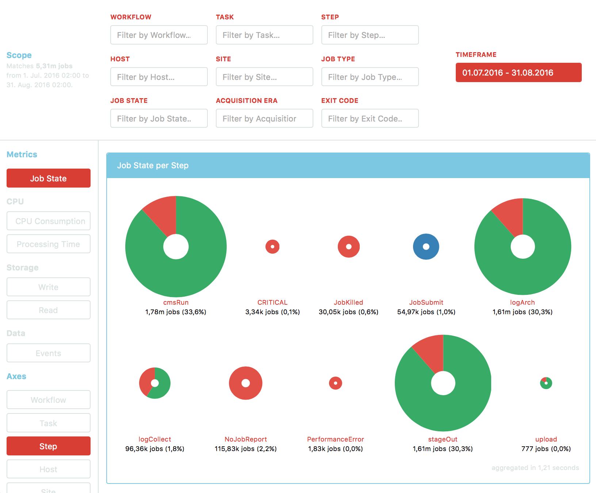
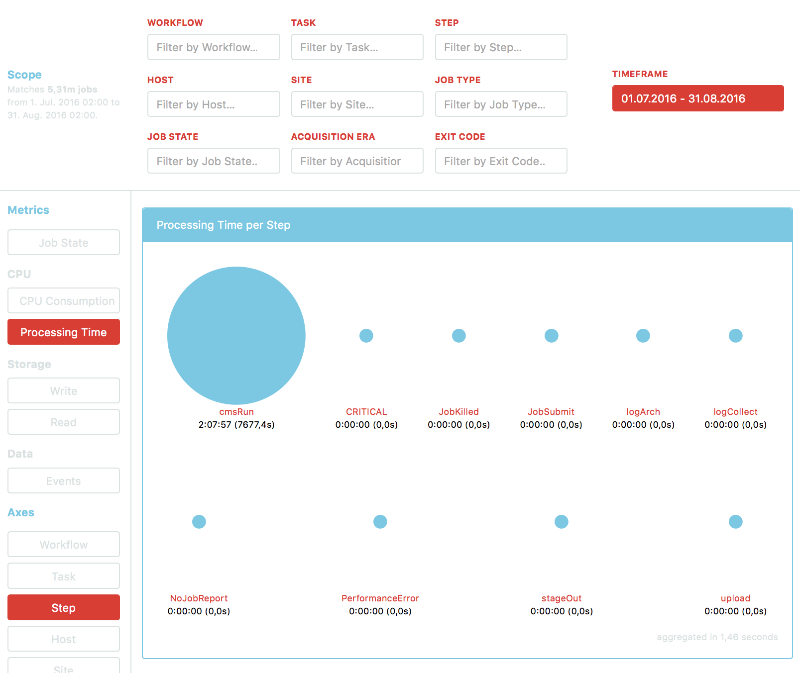
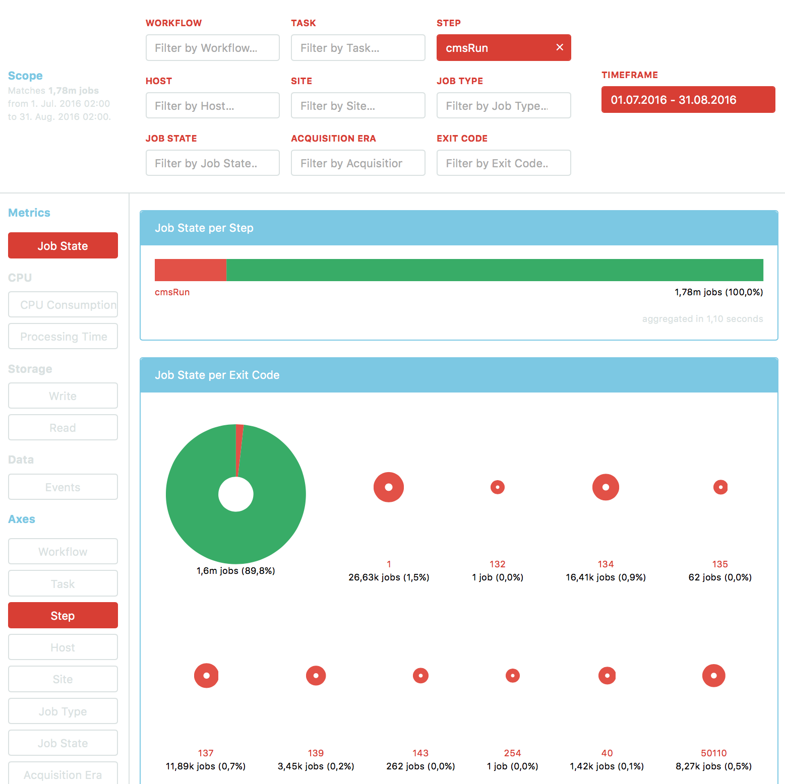
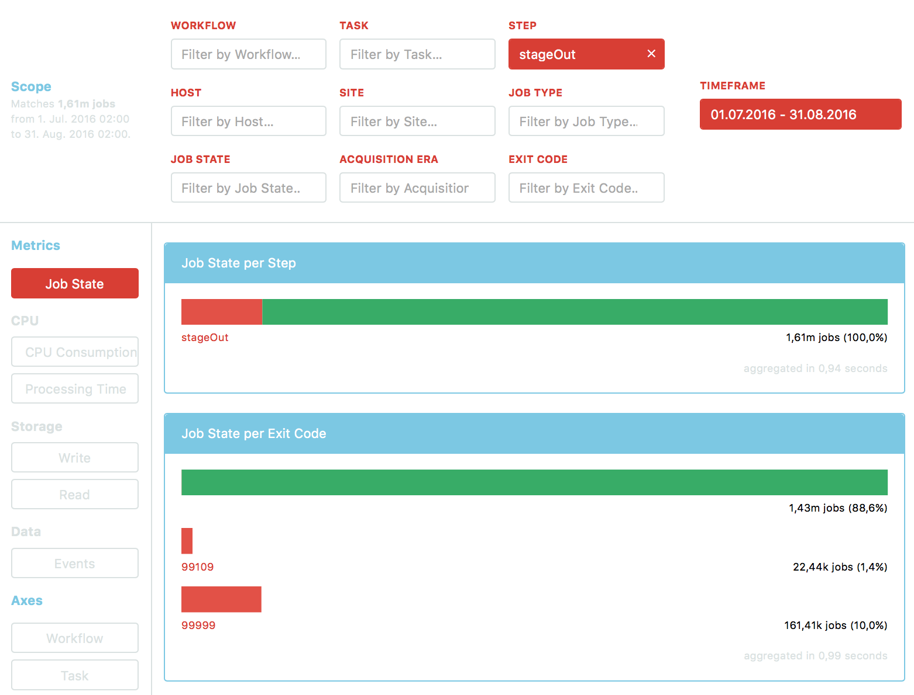

# Report 009 - September 2, 2016

## Error exit codes in UI

- Following up on my [WMArchive issue #216](https://github.com/dmwm/WMArchive/issues/216), I now read exit codes from the environment variable `WMARCHIVE_ERROR_CODES`. It is assumed to be a dictionary of exit codes with their descriptions.
- For testing purposes I load a [sample dictionary](sample_data/wmarchive_error_codes.json) when running the server, but rely on the environment variable to be set up in a production environment.
- The exit code descriptions are then returned from any call to `/wmarchive/data/performance` that specifies `exitCode` either in `suggestions` or `axes` as a dictionary in `supplementaryData.exitCodes`.
- The UI then displays the description alongside any exit code. Thus they appear both in the scope filter suggestions and visualization axes:

  

  
- Note that the dictionary of exit codes appears to be incomplete. Since it is generated from WMCore and WMArchive code, this issue will presumably also arise in the production environment. In particular the following exit codes are not documented:
  - 11003
  - 40
  - 61202
  - 80
  - 86
  - 99303
  - 99999

## Dates and temporal precision in performance data structure

- I moved the `start_date` and `end_date` from the root to the `scope` of an aggregated performance data document in MongoDB. This brings the temporal scope in line with the other scope filters.
- I also added the `scope.timeframe_precision` field. It holds values such as `hour`, `day`, `week` or `month` that match the timespan between `scope.start_date` and `scope.end_date`. This field can be regarded as a cache, since its value is redundant, but it eases database queries and can serve as an index.
- The full updated scope is detailed in [Report 005](005_2016-08-05.md).
- I also renamed the MongoDB database and collection to `aggregated.performance` for the aggregated performance data since it does not hold only daily data anymore.

## Preparing performance data aggregation

**Aggreggation tool:**

- To aggregate performance data, I so far worked with the `WMArchive.PySpark.RecordAggregator` map-reduce script that is called by the `WMArchive/bin/myspark` tool. We now transition to the `WMArchive.Tools.fwjr_aggregator` tool for a more efficient usage of the Spark framework. This script is `spark-submit`ted directly through the `WMArchive/bin/fwjr_aggregator` script.
- I implemented the `WMArchive/bin/aggregate_performance` script as an abstraction over the underlying aggregation mechanism. It calls the `WMArchive.Tools.fwjr_aggregator` script by default. With the flag `--use_myspark` it falls back to the old mechanism.
- The `WMArchive/bin/aggregate_performance` script exposes a flexible command line interface to specify the data to aggregate over. It interprets its first positional argument as either a date such as `2016-06-28`, a number of days ago such as `0` for today or `1` for yesterday, or a full HDFS path. It requires the user to specify a temporal `--precision` such as `hour`, `day`, `week` or `month` and optionally accepts a `--min_date` and `--max_date`.

  As an example the following will aggregate yesterday's data in HDFS with hourly precision:

  ```
  ./bin/aggregate_performance 1 --precision=hour
  ```
- Note that the `fwjr_aggregator` tool is not complete yet and does not write to MongoDB until fully implemented. Use the `--use_myspark` flag to fall back to the old mechanism.

**Cleanup tool:**
- I also wrote a cleanup script in `WMArchive/bin/clean_performance` to regularly clean aggregated performance data in MongoDB by gradually decreasing precision. For each temporal precision tier it removes data older than a given timespan and regenerates this data with a lower precision.

**Cronjobs:**
- These scripts will be run regularly by cronjobs in the production environment. Since new data is scheduled to arrive in the HDFS daily at midnight, the aggregation and cleanup tools should be run subsequently every day. They do not interfere with each other, so their order is irrelevant.

  I suggest the following `crontab` setup:

  ```
  0 3 * * * /path/to/WMArchive/bin/aggregate_performance 1 --precision=hour
  0 3 * * * /path/to/WMArchive/bin/clean_performance
  ```

## Handling FWJR steps in the aggregation procedure

- Each FWJR such as [this](sample_data/FWJR.json) consists of a list of `steps` that together constitute the computing job. A step is always of one of several types. The visualization below shows their distribution over ~5.31m individual steps:

  

  Clearly, most steps are of the `"cmsRun"`, `"stageOut"` and `"logArch"` types.
- A number of scope identifiers, such as the processing `site`, are specific to each step. In particular, each step can fail individually and thus produce one or more exit codes. Also the `acquisitionEra` is a property of each step's `output`s.
- Most importantly, the `performance` metrics that are aggregated over are a property of each step.
- Therefore I currently treat every step individually and provide their type as the scope filter `step`. To reflect this behaviour I adjusted the formatting in the UI to display _steps_ instead of _jobs_ for now.  It is crucial to re-evaluate this behaviour.
- Note that in the data at hand only `"cmsRun"` steps provide performance data at all, so the other steps do not interfere with these numbers:

  
- One option is to discard any information on steps during the aggregation procedure and instead merge all steps into one job document. Since most FWJR data resides in the steps, the implementation of the merging procedure would have a significant impact on the resulting aggregated data. An opinionated procedure that makes assumptions on the importance of some steps over others or handles them differently can therefore damage the objectiveness of the aggregated data and thus may obscure the very information the service is supposed to provide.
- The existing service already provides the ability to filter for specific steps or regular expressions, so users may always just filter for `"cmsRun"` steps only if they wish. It may however be useful to investigate failures in specific steps, such as the difference between exit code distributions:

  - Exit code distribution for `"cmsRun"` steps:

    

  - Exit code distribution for `"stageOut"` steps:

    

  Apparently, even though both step types have a similar failure rate of ~10% overall, their reasons of failure differ greatly.
- Any decision concerning the aggregation procedure should take into account that it intrinsically does not retain information on individual jobs. Instead, the procedure generates one document with performance metrics for each set of unique scope values in MongoDB. One document therefore corresponds to many jobs. These documents in MongoDB are then aggregated over again on user queries from the UI, taking into account the selected scope filters, metrics and axes. The decision should therefore be based on the performance data structure detailed in [Report 005](005_2016-08-05).
- An option to retain both the individual steps and the information on the number of jobs, as opposed to the number of steps, is to introduce a count where one step counts as an evenly distributed fraction of a job. For example in a job with four steps, each step would contribute a value of 0.25 to the job count.
