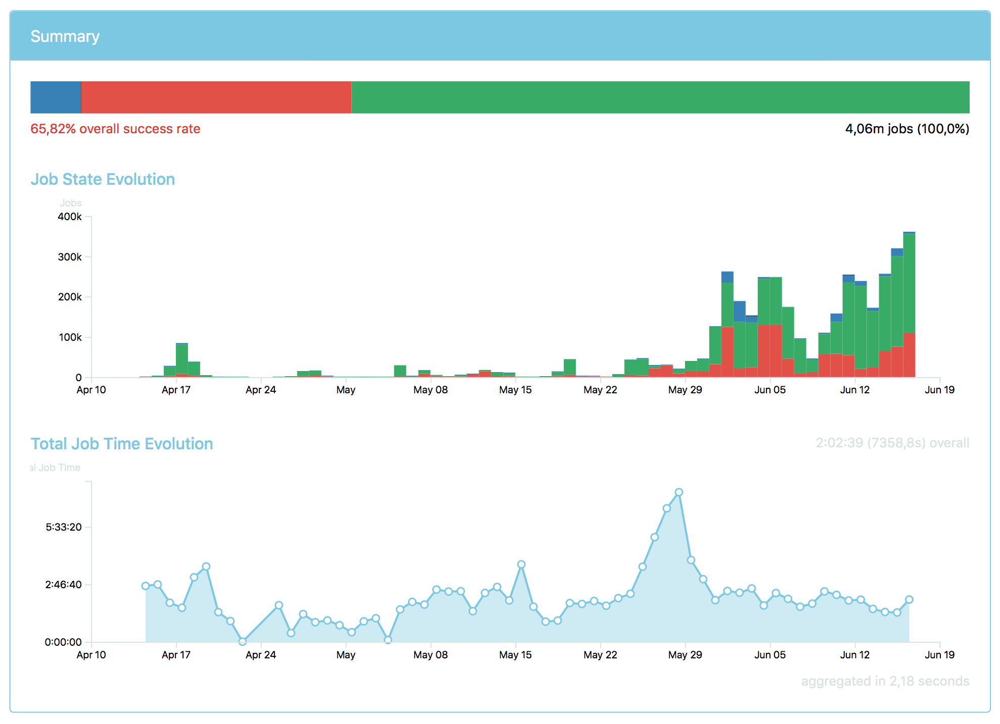
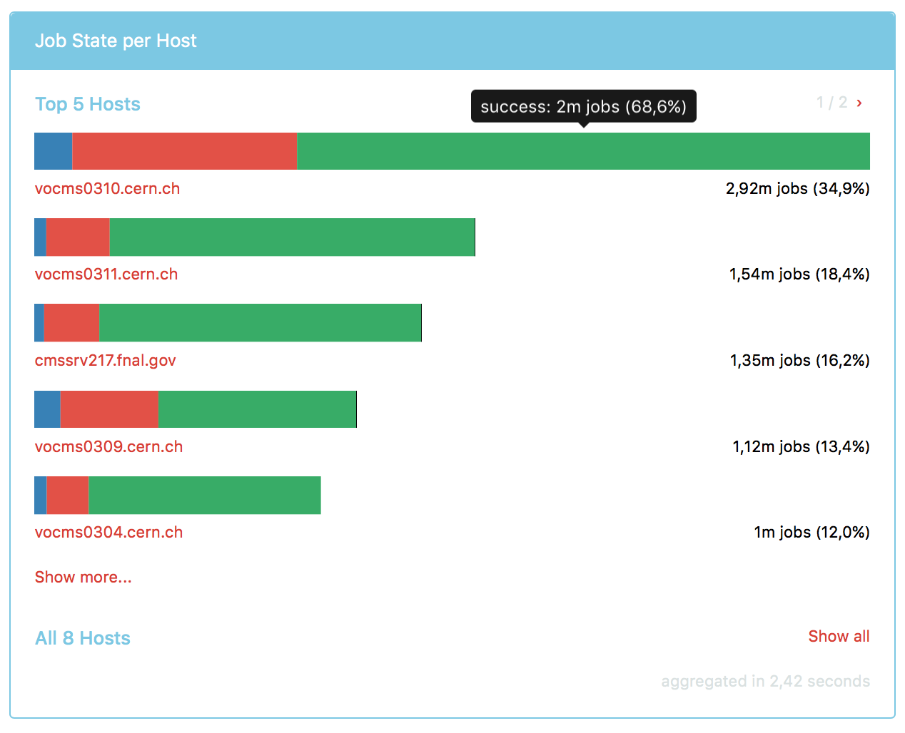
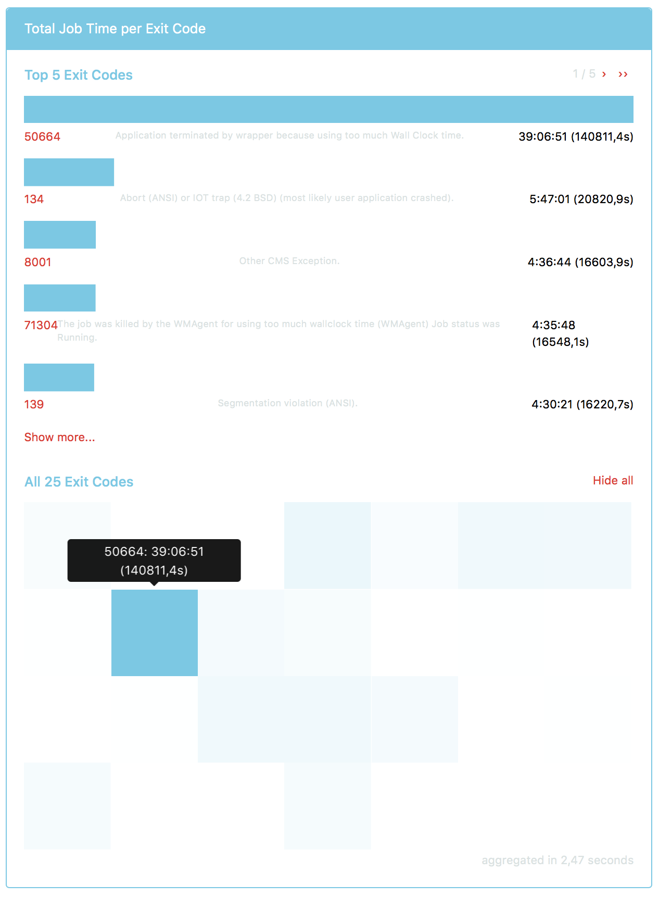
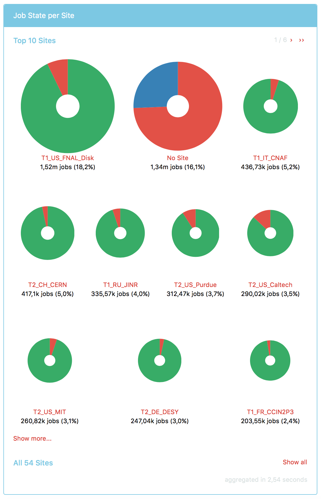

# Report 010 - September 9, 2016

## Summary section

- I added a summary section to the performance UI that gives an overview of the aggregated data. It shows the time evolution and overall average for each selected metric:

  

## Interactive and responsive visualizations

- Visualizations are now limited to their top five values by default and present them as bar charts. The paging buttons allow the user to flip through the data or jump to the beginning or end. Users can also expand the list to show more than five values with the button below the charts:

  
- To obtain an overview of the entire dataset the user can use the _Show all_ button to toggle a heatmap:

  
- Only sites are presented as circular charts instead of bars to provide an intuitive visual distinction that hints at their geographic nature:

  

## Human-readable formatting for `null` values

- `null` axis values are now properly formatted, e.g. as _No site_ or _No host_.

## Metrics presented in the UI

- Following up on responses to my [WMArchive issue #216](https://github.com/dmwm/WMArchive/issues/216) and the [WMCore issue 7140](https://github.com/dmwm/WMCore/issues/7140) I adjusted the set of presented metrics in the UI to those suggested in the issues.

## Aggregation procedure

- The discussion on aggregating jobs or steps that is detailed in [Report 009](009_2016-09-02.md#handling-fwjr-steps-in-the-aggregation-procedure) lead to the decision to implement an aggregation procedure that yields information on _jobs_, since these are the entities data operators care about.
- To this end the aggregation procedure must operate in two phases:
  1. For each job extract both the scope values as well as the performance metrics from the list of steps, possibly by combining metrics from multiple steps.
  2. Aggregate performance metrics over all jobs grouped by their scope values.
- Since the resulting data is highly dependent on the implementation of this algorithm, it must be carefully constructed. In particular, any assumptions on the FWJR data structure must be explicitly documented and reviewed based on the FWJR documentation. Since the latter is very sparse I suggest to improve it as of my [WMArchive issue #216](https://github.com/dmwm/WMArchive/issues/216). I list the assumptions I make in the procedure [below](#assumptions-made-in-the-aggregation-procedure).
- The algorithm to combine performance metrics from multiple steps in phase 1 is particularly crucial to review and also discussed [below](#assumptions-made-in-the-aggregation-procedure).
- I implemented most of the aggregation procedure in [WMArchive.Tools.fwjr_aggregator](https://github.com/knly/WMArchive/blob/master/src/python/WMArchive/Tools/fwjr_aggregator.py) and documented the remaining tasks therein.

## Assumptions made in the aggregation procedure

- `meta_data.ts` is a UTC timestamp.
- `task` is a list separated by `/` characters, where the first value is the job's `workflow` name and the last value is the job's `task` name.
- All `steps.site` are equal.
- The first element in `flatten(steps.errors)` is the reason of failure for the job.
- All `flatten(steps.outputs.acquisitionEra)` are equal.
- All `steps.performance` combine to a job's `performance` as follows:
  - _Sum_ values with the same key.
