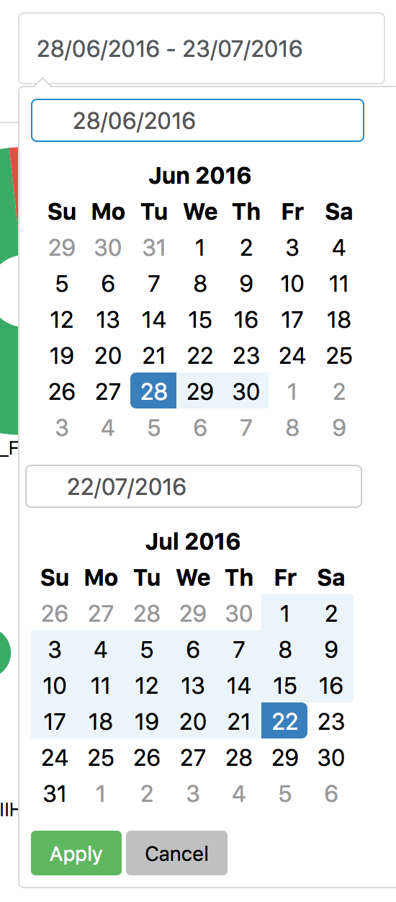

# WMArchive Aggregation Project

This project is part of the [WMArchive](https://github.com/dmwm/WMArchive) project that stores the CMS workflow and data management _framework job reports (FWJRs)_.

An aggregation pipeline regularly processes the database of FWJRs to collect performance metrics. The web app visualizes the aggregated data and provides flexible filters and options to assist the CMS data operators in assessing the performance of the CMS computing jobs.

## Progress Reports

These reports document my weekly progress on the project:

- [001 - July 8, 2016](001_2016-07-08.md)
- [002 - July 15, 2016](002_2016-07-15.md)
- [003 - July 22, 2016](003_2016-07-22.md)
- [004 - July 29, 2016](004_2016-07-29.md)
- [005 - August 5, 2016](005_2016-08-05.md)
- [006 - August 12, 2016](006_2016-08-12.md)
- [007 - August 19, 2016](007_2016-08-19.md)

Please refer to these reports also for the following topics:
- Scope data structure: [Report 005](https://github.com/knly/WMArchiveAggregation/blob/master/005_2016-08-05.md#flattened-data-structure)
- Performance data structure: [Report 007](https://github.com/knly/WMArchiveAggregation/blob/master/007_2016-08-19.md#aggregation-over-all-available-performance-metrics)
- Accessing the test deployment on `vocms013`: [Report 005](https://github.com/knly/WMArchiveAggregation/blob/master/005_2016-08-05.md#test-deployment)
- Accessing the prototype deployment on the CMS testbed: [Report 007](https://github.com/knly/WMArchiveAggregation/blob/master/007_2016-08-19.md#prototype-deployment)
- Overview of UI and visualizations: [Report 006](https://github.com/knly/WMArchiveAggregation/blob/master/006_2016-08-12.md)
- [Running the WMArchive server](docs/running-wmarchive-server.md)
- [Generating sample data](docs/generating-sample-data.md)

## Collected Feedback and TODOs:

**Timeframe:**

- Initial timeframe will be dynamic, e.g. last week or month. Currently it defaults to _Juny 28th to now_ since sample data starts at July 1st.
- No restriction on timeframe planned, performance implications should be addressed through granularity of data
- [ ] Improve timeframe picker. Right now it should look like presented below but does not seem to work reliably.

  
- _It would be nice to show on a web (next to timeframe title) the actual
dates used in shown plots_ - The dates in the timeframe picker are the dates used for the visualizations, but the sample data is only available in July at the moment.
- [ ] In the context of the scope I could add information on the number of jobs that match this scope, e.g. _matches x jobs_ under the timeframe selector.
- _when someone change timeframe it should be shown again_ - I need some more information here
- [ ] Adjust the timeframe picker's format to the user's locale.
- _previous/next buttons no showing up in the calendar (Firefox browser, at least)_
- _I can get three calendars, two if I click on timeframe box and additional one
 if I click on down-arrow in this box, see attachment_, - Couldn't find any attachement, so some information needed. Generally, the timeframe picker needs some improvements.

**Visualizations:**

- [ ] Restrict number of data points to a reasonable number, since e.g. workflows, tasks or steps have too many distinct values for large time frames. Alternatively visualize differently, e.g. in a heat map.
- [ ] Implement legends for visualizations
- _I'm not sure why certain axes are pie-chart while others are bars. I think it
 should be consistent interface or let user choose, like add drop down next to
 title to show as bar, pie-chart_ - I found the bars take up too much space, so for more than 5 data points I implemented the pie visualization. I could also e.g. show hosts always as bars and sites, workflows, etc. as pies, or implement an alternative visualization altogether.
- Min/Max sizes in pie visualization? - The user can also already click any of the pies' labels to show filter for this, then they see the jobstate distribution in full size.
- [ ] Fix overlong labels overlapping each other
- _What is the Events data metric? I see 13755 for vocms0304 (?) Same for the Storage and CPU metrics, their
results don't make too much sense to me._
- [ ] Sorting: By value, by label, etc? Should the user be able to select the sorting, and if so, globally or per-chart?
- [ ] Human-readable format for _null_ values
- _On the CPU metrics, what's the difference between "CPU Consumption" and "Processing Time". I'm in favor
of keeping the same (or closer) metric to what is in the FJR. So "CPU Consumption" --> "Total Job CPU" and
"Processing Time" --> Total Job Time_
- _We should add Memory RSS metrics as well, basically average and peak, though I do not see Average in your
example FJR._

**UI:**

- Keep upper case labels?
- _Error Exit code did not seem to do anything_ - This works fine in my testing, so what went wrong?
- _It took long time to update the “pie” when Job State set to success. Had to kill it._ - Also need additional information here.
- The suggestions in the scope filter dropdowns are all distinct values of that particular scope filter that exist in the database, filtered by the remaining scope.
- [ ] Display exit codes in human-readable format
- [ ] Possibility to select multiple scope filter values, e.g. multiple hosts? Perhaps even a RegExp?
- _make the page layout/content wider. Right now almost half of my
screen is empty (left + right empty columns). Can we better use that space to present better and more
plots?_ - The layout is responsive, it adapts to all screen sizes, but it's not oprimized at all yet. I will work on a better layout for large screens and also adjust the breakpoints for smaller screens and mobile.

**Performance:**

- Data queries from the UI can take a significant amount of time. I will investigate this. We will probably fix this by limiting the temporal resolution.

**_APIs_ page:**

- This page existed before, I did not write it. Do we need to keep it? I can write about the `performance` endpoint of the server that I implemented, but hardly about the rest.

**Utility:**

- [ ] Functionality to share specific visualizations, e.g. via URL
