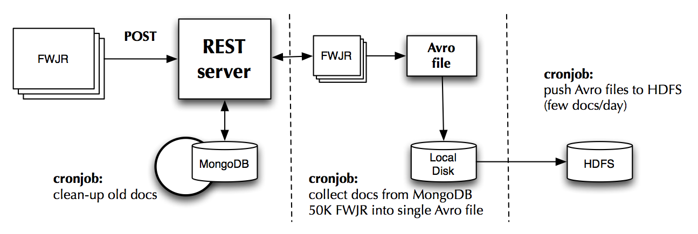
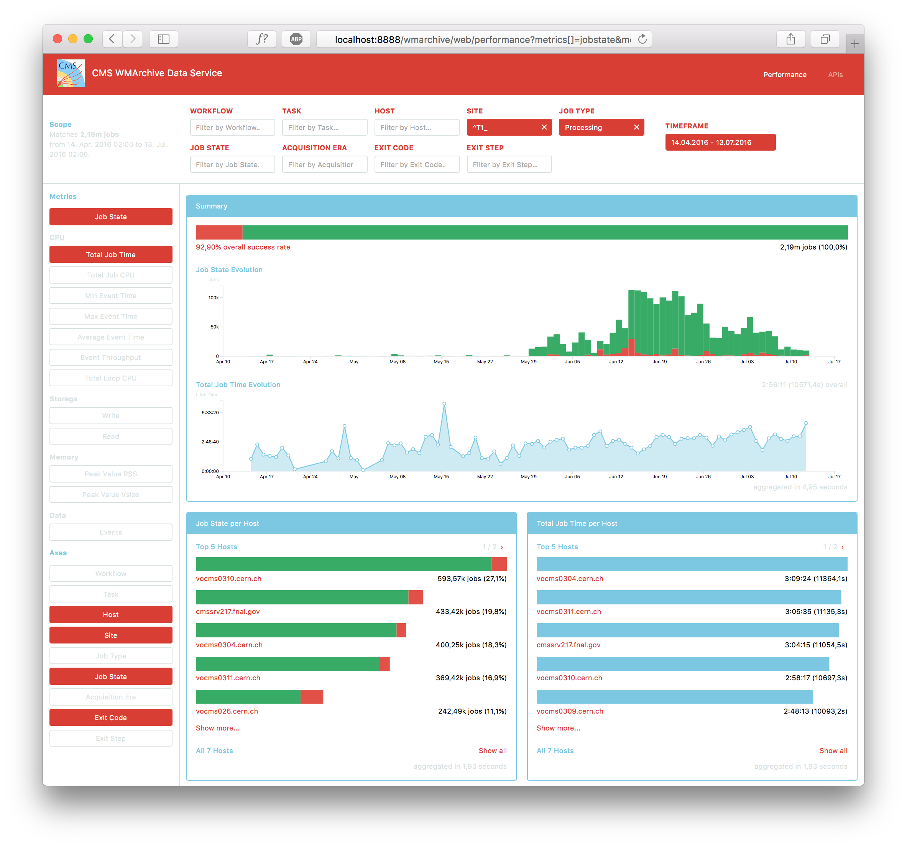

# WMArchive Performance Service

**CERN Summer Student Programme 2016**

- **Author:** [Nils Leif Fischer](https://github.com/knly/)
- **Supervisors:**
  - [Valentin Kuznetsov](http://www.lns.cornell.edu/~vk/contacts.html), Cornell University
  - [Dr. Dirk Düllmann](https://dirkduellmann.com), CERN
- **Date:** June 27, 2016 to September 23, 2016
- **Abstract:**

  This project is part of the [WMArchive](https://github.com/dmwm/WMArchive) project that provides long-term storage for the CMS workflow and data management _framework job reports (FWJRs)_.

  An aggregation pipeline regularly processes the distributed database of FWJRs to collect performance metrics. An [interactive web interface](https://cmsweb.cern.ch/wmarchive/web/performance) visualizes the aggregated data and provides flexible filters and options to assist the CMS data operators in assessing the performance of the CMS computing jobs.
- **[Original proposal](project-description.pdf)**
- **[Report in the CERN CDS](https://cds.cern.ch/record/2217918)**

## Overview

The CMS production agents schedule jobs on the computing grid. When a job finishes it generates a FWJR. The agent then posts this FWJR to the WMArchive REST server that buffers it in a short-term MongoDB database. Then every day the new job reports are converted into a binary Avro file format and migrated to the long-term HDFS storage. This long-term storage is designed to hold millions of these FWJR documents for an indefinite amount of time. This architecture is summarized in the diagram below:

The WMArchive Performance Service project is about retrieving this data stored in the long-term archive and visualizing it in a web interface for CMS data operators to investigate.

Of course to access the data in the long-term HDFS storage it is necessary to schedule jobs that retrieve the data, and those can take a significant amount of time. So to provide a responsive user interface I constructed an aggregation pipeline that regularly processes the distributed database of FWJRs to collect performance metrics and cache the aggregated data back in the MongoDB, where it is quickly accessible by the REST server and the UI. So this cache is not data on each individual job report but instead aggregated data grouped only by a number of attributes data operators may want to filter by, so for example the job success state, its host or its processing site.

The second part of the project is to build a web interface for CMS data operators to visualize and investigate the aggregated data. It provides flexible filters and options to assist the CMS data operators in assessing the performance of the CMS computing jobs. The screenshot below shows the result of my work on the performance service frontend this summer that is available on the [CMSWeb Testbed](https://cmsweb-testbed.cern.ch/wmarchive/web/performance).

## Technologies

- Big-data storage backend: [Apache Hadoop](http://hadoop.apache.org)
- Aggregation pipeline: [Apache Spark](https://spark.apache.org), [MongoDB](https://www.mongodb.com), Python
- REST web server: [WMArchive](https://github.com/dmwm/WMArchive), Python
- Frontend: JavaScript with [Backbone.js](http://backbonejs.org), HTML, CSS, [Sass](http://sass-lang.com)
- Visualization: [D3.js](https://d3js.org)

## Documentation

**Preparation:**
- [Running the WMArchive Server](docs/running-wmarchive-server.md)
- [Generating sample data](docs/generating-sample-data.md)

**Usage and Implementation:**
- [Performance data REST endpoint](docs/performance-data-rest-endpoint.md)
- [Performance UI architecture](docs/performance-ui-architecture.md)
- [Common tasks](docs/common-tasks.md)

**Aggregation and Data**:
- [Performance data structure](docs/performance-data-structure.md)
- [Aggregation procedure](docs/aggregation-procedure.md)

**Outlook:**
- [Pending improvements](docs/pending-improvements.md)
- [Known issues](docs/known-issues.md)

## Progress Reports

These reports document my weekly progress on the project. Please also refer to them for detailed documentation on the project:

- [001 - July 8, 2016](001_2016-07-08.md)
  - [Running the Server and generating sample data](001_2016-07-08.md#running-the-server-and-generating-sample-data)
  - [Data structure considerations for performance metrics](001_2016-07-08.md#data-structure-considerations-for-performance-metrics)
  - [Implementation of a first aggregation pipeline](001_2016-07-08.md#implementation-of-a-first-aggregation-pipeline)
  - [Mockup of the WMArchive Performance Web UI](001_2016-07-08.md#mockup-of-the-wmarchive-performance-web-ui)
  - [First implementation of the WMArchive Performance Web UI](001_2016-07-08.md#first-implementation-of-the-wmarchive-performance-web-ui)
- [002 - July 15, 2016](002_2016-07-15.md)
  - [ElasticSearch and Kibana](002_2016-07-15.md#elasticsearch-and-kibana)
  - [Frameworks and Libraries](002_2016-07-15.md#frameworks-and-libraries)
  - [Prototype Implementation](002_2016-07-15.md#prototype-implementation)
- [003 - July 22, 2016](003_2016-07-22.md)
  - [`/data/performance` REST endpoint](003_2016-07-22.md#dataperformance-rest-endpoint)
  - [WMArchive performance client architecture](003_2016-07-22.md#wmarchive-performance-client-architecture)
- [004 - July 29, 2016](004_2016-07-29.md)
  - [Additional scope features](004_2016-07-29.md#additional-scope-features)
  - [Generalized visualization architecture](004_2016-07-29.md#generalized-visualization-architecture)
  - [Visualization improvements](004_2016-07-29.md#visualization-improvements)
  - [Persistent URLs](004_2016-07-29.md#persistent-urls)
- [005 - August 5, 2016](005_2016-08-05.md)
  - [Flattened data structure](005_2016-08-05.md#flattened-data-structure)
  - [Generalized jobstate visualization](005_2016-08-05.md#generalized-jobstate-visualization)
  - [Aggregator optimization](005_2016-08-05.md#aggregator-optimization)
  - [Test deployment](005_2016-08-05.md#test-deployment)
  - [Remaining tasks](005_2016-08-05.md#remaining-tasks)
- [006 - August 12, 2016](006_2016-08-12.md)
  - [Finalizing the Scope](006_2016-08-12.md#finalizing-the-scope)
  - [Generalized visualizations for all metrics](006_2016-08-12.md#generalized-visualizations-for-all-metrics)
  - [Time series visualization](006_2016-08-12.md#time-series-visualization)
  - [Human-readable formatting](006_2016-08-12.md#human-readable-formatting)
  - [Loading Indicator](006_2016-08-12.md#loading-indicator)
- [007 - August 19, 2016](007_2016-08-19.md)
  - [Aggregation over all available performance metrics](007_2016-08-19.md#aggregation-over-all-available-performance-metrics)
  - [Finalized Scope](007_2016-08-19.md#finalized-scope)
  - [Dynamic visualization handling](007_2016-08-19.md#dynamic-visualization-handling)
  - [Prototype deployment](007_2016-08-19.md#prototype-deployment)
- [008 - August 26, 2016](008_2016-08-26.md)
  - [Dynamic Timeframe and Timeframe Picker](008_2016-08-26.md#dynamic-timeframe-and-timeframe-picker)
  - [Scope UI](008_2016-08-26.md#scope-ui)
  - [Regular expressions in scope filters](008_2016-08-26.md#regular-expressions-in-scope-filters)
  - [Responsive layout for large screens](008_2016-08-26.md#responsive-layout-for-large-screens)
  - [Visualizations](008_2016-08-26.md#visualizations)
  - [Performance](008_2016-08-26.md#performance)
  - [Utility](008_2016-08-26.md#utility)
- [009 - September 2, 2016](009_2016-09-02.md)
  - [Error exit codes in UI](009_2016-09-02.md#error-exit-codes-in-ui)
  - [Dates and temporal precision in performance data structure](009_2016-09-02.md#dates-and-temporal-precision-in-performance-data-structure)
  - [Preparing performance data aggregation](009_2016-09-02.md#preparing-performance-data-aggregation)
  - [Handling FWJR steps in the aggregation procedure](009_2016-09-02.md#handling-fwjr-steps-in-the-aggregation-procedure)
- [010 - September 9, 2016](010_2016-09-09.md)
  - [Summary section](010_2016-09-09.md#summary-section)
  - [Interactive and responsive visualizations](010_2016-09-09.md#interactive-and-responsive-visualizations)
  - [Human-readable formatting for null values](010_2016-09-09.md#human-readable-formatting-for-null-values)
  - [Metrics presented in the UI](010_2016-09-09.md#metrics-presented-in-the-ui)
  - [Aggregation procedure](010_2016-09-09.md#aggregation-procedure)
  - [Assumptions made in the aggregation procedure](010_2016-09-09.md#assumptions-made-in-the-aggregation-procedure)
- [011 - September 16, 2016](011_2016-09-16.md)
  - [Loading metrics dynamically](011_2016-09-16.md#loading-metrics-dynamically)
  - [Reading MongoDB database from environment](011_2016-09-16.md#reading-mongodb-database-from-environment)
  - [Project-wide documentation](011_2016-09-16.md#project-wide-documentation)
  - [Preparations for the presentation](011_2016-09-16.md#preparations-for-the-presentation)
- [Final presentation](presentation.pdf)

## Acknowledgements

This project gave me the unique opportunity to both, learn to apply a variety of modern computing technologies to aid in scientific data processing, and experience the extraordinary intercultural and scientific environment at CERN.

For the former I would like to thank the WMArchive group and particularly Valentin Kuznetsov for their professional support and encouragement during this project.

For the latter I must extend my gratitude to my fellow summer students that filled this summer with cultural and personal differences that were never in need of resultion but instead served only to enrich every participant's experience and appreciation of each other. Remarkably, merely assembling a crowd of aspiring scientists to work in CERN's stimulating and resourceful environment suffices to produce these most appreciable qualities, thus elevating them to virtues intrinsic to the scientific community. I am therefore particularly grateful for the plethora of contributors to international scientific institutions such as CERN for enabling researchers to work together in our quest to understand the universe we live in.
