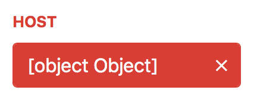

# WMArchive Performance Service

This project is part of the [WMArchive](https://github.com/dmwm/WMArchive) project that stores the CMS workflow and data management _framework job reports (FWJRs)_.

An aggregation pipeline regularly processes the database of FWJRs to collect performance metrics. [The web app](https://cmsweb.cern.ch/wmarchive/web/performance) visualizes the aggregated data and provides flexible filters and options to assist the CMS data operators in assessing the performance of the CMS computing jobs.

The WMArchive Performance Service was implemented by [Nils Leif Fischer](https://github.com/knly/) as part of the [CERN Summer Student Programme 2016](http://hr-dep.web.cern.ch/content/summer-students).

## Documentation

**Preparation:**
- [Running the WMArchive Server](docs/running-wmarchive-server.md)
- [Generating sample data](docs/generating-sample-data.md)

**Usage and Implementation:**
- [Performance data REST endpoint](docs/performance-data-rest-endpoint.md)
- [Performance UI architecture](docs/performance-ui-architecture.md)

**Aggregation and Data**:
- [Performance data structure](docs/performance-data-structure.md)
- [Aggregation procedure](docs/aggregation-procedure.md)

## Progress Reports

These reports document my weekly progress on the project. Please also refer to them for detailed documentation on the project:

- [001 - July 8, 2016](001_2016-07-08.md)
  - [Running the Server and generating sample data](001_2016-07-08.md#running-the-server-and-generating-sample-data)
  - [Data structure considerations for performance metrics](001_2016-07-08.md#data-structure-considerations-for-performance-metrics)
  - [Implementation of a first aggregation pipeline](001_2016-07-08.md#implementation-of-a-first-aggregation-pipeline)
  - [Mockup of the WMArchive Performance Web UI](001_2016-07-08.md#mockup-of-the-wmarchive-performance-web-ui)
  - [First implementation of the WMArchive Performance Web UI](001_2016-07-08.md#first-implementation-of-the-wmarchive-performance-web-ui)
- [002 - July 15, 2016](002_2016-07-15.md)
  - [ElasticSearch and Kibana](002_2016-07-15.md#elasticsearch-and-kibana)
  - [Frameworks and Libraries](002_2016-07-15.md#frameworks-and-libraries)
  - [Prototype Implementation](002_2016-07-15.md#prototype-implementation)
- [003 - July 22, 2016](003_2016-07-22.md)
  - [`/data/performance` REST endpoint](003_2016-07-22.md#dataperformance-rest-endpoint)
  - [WMArchive performance client architecture](003_2016-07-22.md#wmarchive-performance-client-architecture)
- [004 - July 29, 2016](004_2016-07-29.md)
  - [Additional scope features](004_2016-07-29.md#additional-scope-features)
  - [Generalized visualization architecture](004_2016-07-29.md#generalized-visualization-architecture)
  - [Visualization improvements](004_2016-07-29.md#visualization-improvements)
  - [Persistent URLs](004_2016-07-29.md#persistent-urls)
- [005 - August 5, 2016](005_2016-08-05.md)
  - [Flattened data structure](005_2016-08-05.md#flattened-data-structure)
  - [Generalized jobstate visualization](005_2016-08-05.md#generalized-jobstate-visualization)
  - [Aggregator optimization](005_2016-08-05.md#aggregator-optimization)
  - [Test deployment](005_2016-08-05.md#test-deployment)
  - [Remaining tasks](005_2016-08-05.md#remaining-tasks)
- [006 - August 12, 2016](006_2016-08-12.md)
  - [Finalizing the Scope](006_2016-08-12.md#finalizing-the-scope)
  - [Generalized visualizations for all metrics](006_2016-08-12.md#generalized-visualizations-for-all-metrics)
  - [Time series visualization](006_2016-08-12.md#time-series-visualization)
  - [Human-readable formatting](006_2016-08-12.md#human-readable-formatting)
  - [Loading Indicator](006_2016-08-12.md#loading-indicator)
- [007 - August 19, 2016](007_2016-08-19.md)
  - [Aggregation over all available performance metrics](007_2016-08-19.md#aggregation-over-all-available-performance-metrics)
  - [Finalized Scope](007_2016-08-19.md#finalized-scope)
  - [Dynamic visualization handling](007_2016-08-19.md#dynamic-visualization-handling)
  - [Prototype deployment](007_2016-08-19.md#prototype-deployment)
- [008 - August 26, 2016](008_2016-08-26.md)
  - [Dynamic Timeframe and Timeframe Picker](008_2016-08-26.md#dynamic-timeframe-and-timeframe-picker)
  - [Scope UI](008_2016-08-26.md#scope-ui)
  - [Regular expressions in scope filters](008_2016-08-26.md#regular-expressions-in-scope-filters)
  - [Responsive layout for large screens](008_2016-08-26.md#responsive-layout-for-large-screens)
  - [Visualizations](008_2016-08-26.md#visualizations)
  - [Performance](008_2016-08-26.md#performance)
  - [Utility](008_2016-08-26.md#utility)
- [009 - September 2, 2016](009_2016-09-02.md)
  - [Error exit codes in UI](009_2016-09-02.md#error-exit-codes-in-ui)
  - [Dates and temporal precision in performance data structure](009_2016-09-02.md#dates-and-temporal-precision-in-performance-data-structure)
  - [Preparing performance data aggregation](009_2016-09-02.md#preparing-performance-data-aggregation)
  - [Handling FWJR steps in the aggregation procedure](009_2016-09-02.md#handling-fwjr-steps-in-the-aggregation-procedure)
- [010 - September 9, 2016](010_2016-09-09.md)
  - [Summary section](010_2016-09-09.md#summary-section)
  - [Interactive and responsive visualizations](010_2016-09-09.md#interactive-and-responsive-visualizations)
  - [Human-readable formatting for null values](010_2016-09-09.md#human-readable-formatting-for-null-values)
  - [Metrics presented in the UI](010_2016-09-09.md#metrics-presented-in-the-ui)
  - [Aggregation procedure](010_2016-09-09.md#aggregation-procedure)
  - [Assumptions made in the aggregation procedure](010_2016-09-09.md#assumptions-made-in-the-aggregation-procedure)
- [011 - September 16, 2016](011_2016-09-16.md)
  - [Loading metrics dynamically](011_2016-09-16.md#loading-metrics-dynamically)
  - [Reading MongoDB database from environment](011_2016-09-16.md#reading-mongodb-database-from-environment)
  - [Project-wide documentation](011_2016-09-16.md#project-wide-documentation)
  - [Preparations for the presentation](011_2016-09-16.md#preparations-for-the-presentation)
- [Final presentation](presentation.pdf)

## Common Tasks

### Adding scope filters

- Adjust `WMArchive.Service.Data.WMAData.validate` to validate the additional query argument with a regular expression as detailed in [the Performance data REST endpoint documentation](docs/performance-data-rest-endpoint.md).
- Adjust `WMArchive.Storage.MongoIO.MongoStorage.performance` by adding the scope filter to the valid `scope_keys`.
- Adjust `WMArchive/src/js/models/scope.js` by adding the scope filter to `app.Scope.filters` and a default value to `app.Scope.defaults` as detailed in [the Performance UI architecture documentation](docs/performance-ui-architecture.md).

### Changing metrics

- Check the value of the `WMARCHIVE_PERF_METRICS` environment variable at runtime of the server. It may point to `WMArchive/src/maps/metrics.json`.
- Edit the file with your changes. Refer to [Report 011](011_2016-09-16.md#loading-metrics-dynamically) for details and **make sure to test the server with your changes since the UI relies on this information**.

## Pending improvements

**UI:**
- [ ] Possibly implement extended sorting functionality
- [ ] Possibly add legends to visualizations where popover tooltips are not quite sufficient
- [ ] Improve ordering behaviour of visualization widgets, possibly including support for rearranging.
- [ ] Include error margins and more statistics in visualizations
- [ ] Refreshing with latest data in realtime
- [ ] Option to share individual visualizations and possibly save them as images

**Aggregation procedure:**
- [ ] Move from the `WMArchive.PySpark.RecordAggregator` aggregation script to the more efficient `WMArchive.Tools.fwjr_aggregator`. Refer to the [Aggregation procedure](docs/aggregation-procedure.md) documentation for detail.

## Known Issues

- [ ] When selecting a scope filter suggestion from the dropdown, the input textfield shows `[object Object]` until it is updated with the fetched data:

  

  This does not occur when the suggestions are just text values instead of the value/description objects used to display exit code descriptions along the scope filter values.
- [ ] Overlong labels overlap each other in pie charts.
